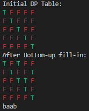
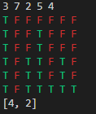
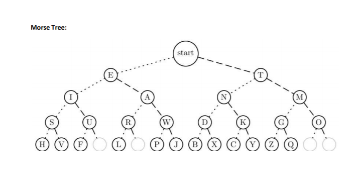

# Coding Interview

Some coding problems to practice & review for interviews

# Navigation

- Data Structures
  1. [Stack](#stack)
  2. [Queue](#queue)
  3. [Heap](#heap)
  4. [Hashtable](#hashtable)
  5. [LinkedList](#linkedlist)
  6. [Graph](#graph)
  7. [Binary Search Tree](#binary-search-tree-avl-tree)
- Sorting
  1. [BubbleSort](#bubble-sort)
  2. [InsertionSort](#insertion-sort)
  3. [MergeSort](#merge-sort)
  4. [QuickSort](#quick-sort)
  5. [RadixSort (and counting sort)](#radix-sort)
  6. [BucketSort](#bucket-sort)
  7. [BinarySearch](#binary-search)
- String
  1. [IsPalindrome](#is-palindrome)
  2. [IsAnagram](#is-anagram)
  3. [RemoveAllChars](#remove-all-chars)
  4. [FindFirstNonRepeatedChar](#find-first-non-repeated-char)
  5. [RemoveDupChar](#remove-duplicate-char)
  6. [MostFrequentChar](#most-frequent-char)
  7. [AllPermutations](#all-permutations)
  8. [LongestSubPalindrome](#longest-sub-palindrome)
  9. [LongestCommonSubsequence](#longest-common-subsequence)
- Array
  1. [FindMissing](#find-missing)
  2. [FindDuplicate](#find-duplicate)
  3. [FindSecondMax](#find-second-max)
  4. [PairSum](#pair-sum)
  5. [SubsetSum](#subset-sum)
  6. [ReverseInPlace](#reverse-in-place)
  7. [Partition](#partition)
- LinkedList
  1. [MiddleElementSinglePass](#middle-element-single-pass)
  2. [NthFromLast](#nth-from-last)
  3. [ReverseSinglyLinkedList](#reverse-singly-linked-list)
  4. [MergeTwoSortedLists](#merge-two-sorted-list)
  5. [RemoveDuplicate](#remove-duplicate)
- Graph
  1. [BreadthFirstSearch](#breadth-first-search)
  2. [DepthFirstSearch](#depth-first-search)
  3. [ShortestPath](#shortest-path)
  4. [EulerianPath](#eulerian-path)
- Binary Tree
  1. [MorseCodeLookup](#morse-code-lookup)
- Number and Math
  1. [IsPowerOfTwo](#is-power-of-two)
  2. [FindPrimeGivenUpperBound](#find-prime-given-upper-bound)
  3. BinaryConversion
  4. SumOfDigits
  5. PrimeFactorization
  6. SieveOfEratosthenes

# Problems

## **Data Structures**

---

- ## Stack

  **Traits:**
  - Last-In-First-Out (LIFO): Data inserted last is removed first.

  **Methods:**
  - push(): Add data to the top of stack.
  - pop(): Remove data on top and return that data.
  - peek(): Return data on top without removing it.
  - size(): Return the number of data in the stack.

  [**C++ Header**](DataStructures/Stack.hpp)

  [**C++ Implementation**](DataStructures/Stack.cpp)

[Back to Top](#navigation)

---

- ## Queue

  **Traits:**
  - First-In-First-Out (FIFO): Data inserted first is removed first.

  **Methods:**
  - enqueue(): Insert data to the end of queue.
  - dequeue(): Remove and return the first data in queue.
  - peek(): Return the first data without removing it.
  - size(): Return the number of data in the queue.

  [**C++ Header**](DataStructures/Queue.hpp)

  [**C++ Implementation**](DataStructures/Queue.cpp)

[Back to Top](#navigation)

---

- ## Heap

  **Traits:**
  - Binary Tree visualization.
  - Parent node is always either smaller/greater than child nodes.
  - Finding min/max = Returning the Root, so it is O(1).
  - Application: Priority Queue, Heap Sort.

  **Methods:**
  - insert(): Insert data and internally "heapify" to satisfy heap properties.
  - remove(): Remove data and internally "heapify" to satisfy heap properties.
  - min()/max(): Return the root element.

  [**C++ Header**](DataStructures/MinHeap.hpp)

  [**C++ Implementation**](DataStructures/MinHeap.cpp)

[Back to Top](#navigation)

---

- ## Hashtable

  **Traits:**
  - Data is stored into the hashed index.
  - Hash function is used to convert data key into valid index.
  - Key -> Hash -> O(1) to retrieve data
  - Collision handlings:
    - Linear Probing: Insert into next available index.
    - Quadratic Probing: Insert into next index that is square of collided index.
    - Double Hasing: Apply second hashing for collision.
    - Chaining: Each index has linked list of collided data.

  **Methods:**
  - insert(): Hash and insert data into proper index.
  - remove(): Hash and remove data from proper index.
  - get(): Hash and find data from the proper index.

  [**C++ Header**](DataStructures/Hashtable.hpp)

  [**C++ Implementation**](DataStructures/Hashtable.cpp)

[Back to Top](#navigation)

---

- ## LinkedList

  **Traits:**
  - Each data is stored as node and collection of data is connected linearly.
  - Singly-Linked: Node has pointer to next node.
  - Doubly-Linked: Node has pointers to prev node and next node.
  - Traversal is in linear time
  - Insertion/Deletion at the head takes O(1)
  - Insertion, Deletion are generally better than array as it doesn't require data shifting.

  **Methods:**
  - insertAtHead(): Insert new data in the beginning of list.
  - insertAtEnd(): Insert new data at the end of list.
  - insert(): Insert new data at given index.
  - removeAtHead(): Remove data from the beginning of list.
  - removeAtEnd(): Remove data from the end of list.
  - remove(): Remove data from the given index.
  - get(): Return the data at the given index.

  [**Java Implementation**](./LinkedList/LinkedList.java)

  [**Python Implementation**](./LinkedList/LinkedList.py)

  [**C++ Implementation**](./LinkedList/LinkedList.cpp)
  [**C++ Header**](./LinkedList/LinkedList.h)

[Back to Top](#navigation)

---

- ## Graph

  **Traits:**
  - Each data is stored in vertex connected by edges.
  - Edge connection relations are stored commonly using:
    - Adjacency Matrix: |V|x|V| table that has 0 to indicate no edge, other numbers to indicate weight between vertices u and v.
      - O(|V|^2) Space.
      - O(1) to check if u and v has edge.
      - O(|V|) to find all neighbors of a vertex.
    - Adjacency List: Each vertex keeps list of its neighbors along with weights.
      - O(|E|) Space.
      - O(deg(u)) to check if u and v has edge.
      - O(deg(u)) to find all neighbors of a vertex u.
  - Configurations:
    - Weighted vs Un-weighted
      - Weighted: Each edge has different weight (or distance).
      - Un-weighted: All edges have the same weight (or distance of 1).
    - Directed vs Un-directed
      - Directed: Edge has direction. u->v, but not necessarily v->u.
      - Un-directed: Edge has no direction. u->v, then v->u.

  **Methods:**
  - addVertex(): Add a new vertex with given data.
  - removeVertex(): Remove a vertex from the graph.
  - addEdge(): Add an edge between two vertices with given weights.
  - removeEdge(): Remove an edge between two vertices.
  - BFS(): Return data in the Breadth-First-Search manner.
  - DFS(): Return data in the Depth-First-Search manner.

  **[Python Implementation](./Graph/Graph.py)**

[Back to Top](#navigation)

---

- ## Binary Search Tree (AVL-Tree)

  **Traits:**
  - At most two child nodes.
  - Left child is always less than the parent.
  - Right child is always greater than the parent.
  - No duplicate data allowed.
  - (AVL-Tree) Balanced: Left and right subtrees differ in heights by no more than 1.
  - Searching in balanced BST takes O(log N).
  - Insertion and deletion both take O(log N).
  - Traversals:
    - In-order: Left-Root-Right
    - Pre-order: Root-Left-Right
    - Post-order: Left-Right-Root
    - Level-order: Each level from left to right

  **Methods:**
  - insert(): Add new data into appropriate position and rebalance.
  - remove(): Remove data from the tree and rebalance.
  - search(): Retrieve data with the given key.
  - inOrder(): Retrieve data in in-order traversal manner.
  - preOrder(): Retrieve data in pre-order traversal manner.
  - postOrder(): Retrieve data in post-order traversal manner.
  - levelOrder(): Retrieve data in level-order traversal manner.

  [**Java Implementation**](BinaryTree/BinaryTree.java)

[Back to Top](#navigation)

---

## **Sorting**

---

- ## Bubble Sort

- ### Problem Statement

    Bubble sort, sometimes referred to as sinking sort, is a simple sorting algorithm that repeatedly steps through the list, compares adjacent elements and swaps them if they are in the wrong order.

  The pass through the list is repeated until the list is sorted.

- ### Solution

  - #### Path to the source codes that solve the problem

    [bubbleSort.cpp](./SearchSort/bubbleSort/bubbleSort.cpp)

  - #### If applicable, What is time complexity of the solution? (Big-O)

    O(N^2).

    Maximum N-1 iterations, and in each iteration, algorithm scans each of N elements.

**[Back To Top](#navigation)**

---

- ## Insertion Sort

- ### Problem Statement

    Insertion sort iterates, consuming one input element each repetition, and growing a sorted output list.

  At each iteration, insertion sort removes one element from the input data, finds the location it belongs within the sorted list, and inserts it there. It repeats until no input elements remain.

- ### Solution

  - #### Path to the source codes that solve the problem

    [insertionSort.java](./SearchSort/insertionSort/insertionSort.java)

  - #### If applicable, What is time complexity of the solution? (Big-O)

      O(N^2).

      Always N-1 iterations, and in each iteration, algorithm compares i-th element to all preceding elements

    to decide i-th element's new order. (More "shifts" required for worst case)

**[Back To Top](#navigation)**

---

- ## Merge Sort

- ### Problem Statement
  Conceptually, a merge sort works as follows:

1. Divide the unsorted list into n sublists, each containing one element (a list of one element is considered sorted).
2. Repeatedly merge sublists to produce new sorted sublists until there is only one sublist remaining. This will be the sorted list.

- ### Solution

  - #### Path to the source codes that solve the problem

    [mergeSort.py](./SearchSort/mergeSort/mergeSort.py)

  - #### If applicable, What is time complexity of the solution? (Big-O)

      O(N log N).

      Similar to binary operations (divide-and-conquer), each split/merge divides the problem

    into subproblems of half the size. It takes log N divisions and in each subproblem, N time to sort.

**[Back To Top](#navigation)**

---

- ## Quick Sort

- ### Problem Statement

  Quicksort is a divide-and-conquer algorithm.
  It works by selecting a 'pivot' element from the array and partitioning the other elements into two sub-arrays, according to whether they are less than or greater than the pivot.
  The sub-arrays are then sorted recursively. This can be done in-place, requiring small additional amounts of memory to perform the sorting.

- ### Solution

- #### Path to the source codes that solve the problem

  [quickSort.java](./SearchSort/quickSort/quickSort.java)

- #### If applicable, What is time complexity of the solution? (Big-O)

  O(N log N).

  partitions array into sub-arrays and then place them in the right place of the pivot.
  The solution used **Hoarse Partition Scheme** (pivot in the middle and two "pointers" from two ends of array)
  So even for sorted array, the worst case is still O(n log n).
  **Lomuto Partition Scheme** (pivot at the end, and comparison "pointer" from start of index) can be O(n^2) on already sorted list.

**[Back To Top](#navigation)**

---

- ## Radix Sort

- ### Problem Statement

  Radix sort sorts digit by digit.
  Starting with least significant digit, algorithm uses counting sort as subroutine to sort the list.
  For example, for 3-digit integers, counting sort is called three times.

  **Counting Sort**

  Counting sort uses counting array to sort elements. (details in source code)

- ### Solution

- #### Path to the source codes that solve the problem

  [countingSort.py](./SearchSort/radixSort/countingSort.py)

  [radixSort.py](./SearchSort/radixSort/radixSort.py)

- #### If applicable, What is time complexity of the solution? (Big-O)

  Counting Sort takes O(N+k) time.

  Given list of N elements, k is the largest element.

  1. Iterate over N elements to count and store occurrences => O(N)
  2. Iterate over k elements of counting array to modify for sorting => O(k)
  3. Iterate over N elements of original array from the end => O(N)

  Radix Sort takes O(d(N+k)) time.

  d is the largest number of digit.

  With X being the largest number with base-10,

  d = floor((log_10)X) + 1

**[Back To Top](#navigation)**

---

- ## Bucket Sort

- ### Problem Statement

  Bucket Sort first places input elements into corresponding bins,
  then sort the bins separately, and lastly concatenate all the bins as a single sorted list.

- ### Solution

  Used linked list to store elements within the same bin.

- #### Path to the source codes that solve the problem

  [linkedList.cpp](./SearchSort/bucketSort/linkedList.cpp)

  [bucketSort.cpp](./SearchSort/bucketSort/bucketSort.cpp)

- #### If applicable, What is time complexity of the solution? (Big-O)

  O(N) to iterate over original list,

  and for each N items, find the correct position to be inserted (take O(k), k is the number of items in the bin)

  This can differ depending on which sorting to use for each bucket.

  In worst case, if all items fall into the same bin, can take O(N^2)

  If all items are evenly distributed, then it can take O(N) time as no sorting within bucket required.

**[Back To Top](#navigation)**

---

- ## Binary Search

- ### Problem Statement

  Binary Search is not a sorting technique, but "depends" on sorting.

  Binary Search utilizes **Sorted** list to search for a target within the given list.

- ### Solution

  It compares middle value to target value, and do the following:

  1. if target == middle, return middle
  2. if target > middle, do recursive search on right of middle
  3. if target < middle, do recursive search on left of middle
  4. if sub-array is not valid (ie. left-end and right-end crossed path), then element is not found, thus return -1 as flag.

- #### Path to the source codes that solve the problem

  **Any sort is fine, but used quickSort for the solution**

  [binarySearch.java](./SearchSort/binarySearch/binarySearch.java)

  [quickSort.java](./SearchSort/quickSort/quickSort.java)

- #### If applicable, What is time complexity of the solution? (Big-O)

  Excluding quick sort described [above](#quick-sort),

  O(log n)

  Because this is simply divide-and-conquer, each recursion keeps "half-ing" the problem. For N elements, it takes at most log N + 1 recursive calls including the very first call from main.

  In each recursion, it simply compares the values and return index, so this is O(1), thus total time complexity is O(log N)

**[Back To Top](#navigation)**

---

## **String**

---

- ## Is Palindrome

- ### Problem Statement

  A palindrome is a word, phrase, number or sequence of words that reads the same backward as forward.

  ie) racecar, level, noon, rotator...

  Write a program to detect if input string is a palindrome.

- ### Solution

  Use stack to store first half of the string, then pop from stack as they match the last half of the string. If non-matching found or if stack has remainders, then the string is not palindrome.

  Careful with even and odd length input.

- #### Path to the source codes that solve the problem

  [isPalindrome.py](./String/isPalindrome.py)

- #### If applicable, What is time complexity of the solution? (Big-O)

  O(N)

  Scans the input string of length N single time.

**[Back To Top](#navigation)**

---

- ## Is Anagram

- ### Problem Statement

  An anagram is a word, phrase, or name formed by rearranging the letters of another, such as cinema, formed from iceman.

  Write a program to detect if a string is an anagram of another input string.

- ### Solution

  **naive approach**: for each char of string A, scans through string B and mark it. Do until all chars of string A are scanned or entire string B is marked. Return true iff both string A and string B are done.

  **improved approach**: Use a frequency dictionary to first count the occurrences of chars in string A, then match freq dict to string B to see if all chars occur with same frequency.

- #### Path to the source codes that solve the problem

  **naive approach**: [isAnagram.py](./String/isAnagram.py)

  **improved approach**: [isAnagram.cpp](./String/isAnagram.cpp)

- #### If applicable, What is time complexity of the solution? (Big-O)

  **naive approach**: O(N\*M), O(N^2)

  N is the length of input string A, and M is the length of input string B.

  For checking anagram, it is highly likely that N and M are equal.

  For each letter in string A, scan through string B, so it is O(N^2)

  **improved approach**: O(N)

  scans through string A of length N, count the occurrences.

  Then scans through string B of length M to match the occurrences.

  Total time complexity is O(max(N,M))

**[Back To Top](#navigation)**

---

- ## Remove All Chars

- ### Problem Statement

  Given a string and an array of characters, remove all occurrences of characters in array from the string. (case-insensitive)

  (Obviously, without using built-in string methods like substring, removeAll, etc)

  Example:

  ```java
  str = removeAllChars("Hello, World", ['h', 'l']);
  print(str);
  // should output:
  // eo, Word
  ```

- ### Solution

  For each char in string, check to see if it is in the array,

  If not then add that char to resulting string.

- #### Path to the source codes that solve the problem

  [RemoveAllChars.java](./String/RemoveAllChars.java)

- #### If applicable, What is time complexity of the solution? (Big-O)

  O(N \* M)

  given string of length N and array of length M.

**[Back To Top](#navigation)**

---

- ## Find First Non-repeated Char

- ### Problem Statement

  Given a string find the first character that does not repeat (AKA, appears only once in the string). (Case-sensitive)

  **Extension**:

  find **ALL** non-repeating characters in the string

  Example:

  ```java
  ch = findFirstNoneRepeatedChar("abacdeac")
  print(ch);
  // should output:
  // b
  // as 'd' and 'e' are not repeating, but not the first.

  // Extension
  arr = findAllNonRepeatedChar("abacdeac")
  print(arr)
  // should output:
  // [b, d, e]  (or any sort of array printing format depend on language)
  ```

- ### Solution

  Iterate over characters in string, and keep track of occurrences using dictionary.

  Once done iterating string, return the first dict key that has occurrence of 1.

- #### Path to the source codes that solve the problem

  [FindNonRepeatedChar.py](./String/FindNonRepeatedChar.py)

- #### If applicable, What is time complexity of the solution? (Big-O)

  O(N)

  N = length of input string.

**[Back To Top](#navigation)**

---

- ## Remove Duplicate Char

- ### Problem Statement

  Given a string, remove all the duplicate characters (case-sensitive).

  Example:

  ```java
  str = removeDupChar("Hello World")
  print(str);
  // should output:
  // He Wrd
  ```

- ### Solution

  Iterate over characters in string, and keep track of occurrences using dictionary.

  Once done iterating string, concatenate all the dict key with freq of 1 into a string.

- #### Path to the source codes that solve the problem

  [RemoveDupChar.java](./String/RemoveDupChar.java)

- #### If applicable, What is time complexity of the solution? (Big-O)

  O(N)

  N = length of input string.

**[Back To Top](#navigation)**

---

- ## Most Frequent Char

- ### Problem Statement

  Given a string, find the most frequent character (return any if multiple, case-sensitive)

  Example:

  ```java
  ch = mostFrequentChar("Hello World")
  print(ch);
  // should output:
  // l
  ```

- ### Solution

  Iterate over characters in string, and keep track of occurrences using dictionary.

  Once done iterating string, find max frequency in the dictionary and return the key char associated with that frequency.

- #### Path to the source codes that solve the problem

  [MostFrequentChar.cpp](./String/MostFrequentChar.cpp)

- #### If applicable, What is time complexity of the solution? (Big-O)

  O(N)

  N = length of input string.

**[Back To Top](#navigation)**

---

- ## All Permutations

- ### Problem Statement

  Given a string, find all possible permutations of string's characters.
  Return array of strings in any order.

  Example:

  ```java
  arr = allPermutations("abcc");
  print(arr);
  // should output: (in any form of array printing format)
  // ["abcc", "acbc", "accb", "bacc", "bcac", "bcca", "cabc", "cbac", "cacb", "cbca", //  "ccab", "ccba"]
  ```

- ### Solution

  Recursively takes portion of string from (0, N-1) -> (N-2, N-1).

  Makes all combinations of swaps with first character and the rest of string,

  and append it into permutation set.

- #### Path to the source codes that solve the problem

  [AllPermutations.py](./String/AllPermutations.py)

- #### If applicable, What is time complexity of the solution? (Big-O)

  O(N!)

  Given string of length N, recursively calls itself N! times.

  Swapping and adding to set each takes O(1).

**[Back To Top](#navigation)**

---

- ## Longest Sub-Palindrome

- ### Problem Statement

  Given a string, find the longest substring that is a palindrome.

  Return any if there are multiple with the same length.

  Example:

  ```java
  LSP = longestSubPalin("abaab");
  print(LSP);
  // should output:
  // baab
  ```

- ### Solution

  String of length 1 is always a palindrome.

  Using dynamic programming, check if substrings are palindrome from bottom-up

  1. create dynamic table arr[N][n]
  2. fill in `null` or `false` for cells where i > j
  3. fill in `true` for cells where i == j (length 1 string)
  4. for all i < j:

     if i+1 > j-1, then check if str[i] == str[j]

     else, check arr[i+1][j-1] (to see the middle sub-portion of substring is itself palindrome), and also str[i] == str[j]

  5. Lastly, for cells with `true`, the max difference between `j` and `i` yields `i` for starting index and `j` for end index.

  **Visualization** _(using `abaab` as input string)_:

  

- #### Path to the source codes that solve the problem

  [LongestSubPalindrome.java](./String/LongestSubPalindrome.java)

- #### If applicable, What is time complexity of the solution? (Big-O)

  O(N^2) for both time and space complexity.

  The algorithm iterates over the N x N table.

**[Back To Top](#navigation)**

---

- ## Longest Common Subsequence

- ### Problem Statement

  Given two strings, find the longest common subsequence of the two.

  Subsequence, unlike substring, is not required to occupy consecutive positions within the original sequences.

  Return any common subsequence if there are multiple with the same length.

  Example:

  ```java
  LCS = longestCommonSubSeq("abcd", "acbad");
  print(LSP);
  // should output either/both:
  // abd, acd
  ```

- ### Solution

  Using dynamic programming:

  1. create dynamic table arr[M+1][n+1]
  2. initialize i=0 and j=0 as `0`
  3. if str1[i]==str2[j]:

     then add `1` to previous LCS (AKA, arr[i-1][j-1])

     if str1[i]!=str2[j]:

     then take the greater value between arr[i-1][j] and arr[i][j-1]

  4. backtrack from the highest value of the table, and generate commons subsequence string.

- #### Path to the source codes that solve the problem

  [LongestCommonSubsequence.cpp](./String/LongestCommonSubsequence.cpp)

- #### If applicable, What is time complexity of the solution? (Big-O)

  O(M\*N) for both time and space complexity.

  The algorithm iterates over the (M+1) x (N+1) table.

**[Back To Top](#navigation)**

---

## **Array**

---

- ## Find Missing

- ### Problem Statement

  Given an unsorted array of size N-1 with no duplicate values from 0 to N, with one missing value.

  Find the missing value between 0 and N.

  **Example:**

  ```java
  missing = findMissing([1, 5, 7, 3, 8, 6, 9, 2, 0]);   // 0~9, with 4 missing
  print(missing);
  // should output either/both:
  // 4
  ```

- ### Solution

  Create a boolean array arr with size N.

  for each i in input array, set arr[i] as true

  Once done iterating input array,

  for each element in array, return `i` for the false cell.

  **Another solution** _(not implemented with code)_

  Sort the array with O(n log n) sorting algorithm,

  return the number that "jumps" 2 steps to the next value.

  O(n log n) time complexity, and O(1) space complexity

  - #### Path to the source codes that solve the problem

    [FindMissing.py](./Array/FindMissing.py)

  - #### If applicable, What is time complexity of the solution? (Big-O)

    O(N) for iterating over input array

    O(N) for space complexity for making boolean array.

**[Back To Top](#navigation)**

---

- ## Find Duplicate

- ### Problem Statement

  Given a list, find a duplicate element.

  Extension: Find all duplicate elements if there are multiple.

  **Example:**

  ```java
  dup = findDup([2, 4, 3, 2, 8, 7, 0, 1, 3]);  // 2 and 3 are duplicates
  print(dup);
  // should output either
  // 2 or 3

  // Extension
  dups = findDup([2, 4, 3, 2, 8, 7, 0, 1, 3]);
  print(dups);
  // should output array in language-specific format
  // [2, 3]
  ```

- ### Solution

  For single duplicate,

  iterate through array, and keep track of counted word using dictionary.

  If the element is already in the dictionary, then return that element.

  For multiple duplicates,

  do the same, but do not return immediately.

  Instead, iterate entire array and push duplicates into returned array.

  - #### Path to the source codes that solve the problem

    [FindDuplicate.py](./Array/FindDuplicate.py)

  - #### If applicable, What is time complexity of the solution? (Big-O)

    O(N) for iterating over input array

**[Back To Top](#navigation)**

---

- ## Find Second Max

- ### Problem Statement

  Given a list of integers, find the second highest value. Return any if multiple.

  **Example:**

  ```java
  secMax = findSecondMax([2, 4, 5, 3, 8, 6, 1]);
  print(secMax);
  // should output
  // 6
  ```

- ### Solution

  Naive approach would simply iterate M times to find Mth highest value,

  but this would take O(N^M) to iterate length N array M times.

  Instead, keep track of M high values in a "ranking" array of size M.

  - #### Path to the source codes that solve the problem

    [FindSecondMax.java](./Array/FindSecondMax.java)

  - #### If applicable, What is time complexity of the solution? (Big-O)

    O(N\*M),

    N = input array size

    M = Mth max value

    M is generally much less than N (generally search for top 3 out of 100 or so),

    but in worst case, M = N => O(N^2)

**[Back To Top](#navigation)**

---

- ## Pair Sum

- ### Problem Statement

  Given an unsorted list of integers and a target value,

  find a pair that sums up to be the target value.

  Return any if multiple pairs are in the array.

  **Example:**

  ```java
  pair = pairSum([3, 7, 2, 5, 6], 9);
  print(secMax);
  // should output
  // [3, 6]
  // or
  // [7, 2]
  ```

- ### Solution

  1. Use dictionary to "remember" elements of array, then find the pair iterating over the array

     (Requires two separate runs on array)

  2. Sort the list first, then use two "pointers" from left-end and right-end to find the pair.

     (Single, or Half, run, but requires pre-sorting)

  - #### Path to the source codes that solve the problem

    Using Dictionary:
    [PairSum.java](./Array/PairSum.java)

    Using sorted array:
    [PairSum.py](./Array/PairSum.py)

  - #### If applicable, What is time complexity of the solution? (Big-O)

    1. Using Dictionary: O(N)

    2. Using sorted Array: with efficient sorting algorithm, O(N log N)

**[Back To Top](#navigation)**

---

- ## Subset Sum

- ### Problem Statement

  Given a list of positive integers and a target sum value,

  find a subset of elements that sums up to the target sum value.

  Return any if multiple subsets are possible.

  **Example:**

  ```java
  subset = subsetSum([3, 7, 2, 5, 4], 6);
  print(subset);
  // should output
  // [4, 2] or [2, 4]
  ```

- ### Solution

  Subset Sum problem is one of the well-known NP-complete problem.

  If naively taking each subset and compare the sum of each subset to the target sum value,

  this would take O(2^n) as there are 2^n possible subsets.

  Using dynamic programming can improve the time complexity with the cost of some space complexity.

  **Visual Dynamic Programming Table (_target = 6_):**

  **each column: 0~sum, each row: 0 and each array element**

  

  - #### Path to the source codes that solve the problem

    [SubsetSum.cpp](./Array/SubsetSum.cpp)

  - #### If applicable, What is time complexity of the solution? (Big-O)

    N: # of elements of input array

    M: target sum

    O(N\*M) for both time and space complexity, as dynamic programming requires the table of size `(N+1) X (M+1)`

**[Back To Top](#navigation)**

---

- ## Reverse In-place

- ### Problem Statement

  Given a list,

  reverse the order without using extra arrays.

  **Example:**

  ```java
  arr = [1, 2, 3, 4, 5]
  reverseInPlace(arr);
  print(arr);
  // should output
  // [5, 4, 3, 2, 1]
  ```

- ### Solution

  Start "pointers" from two opposite ends of the array,

  swap two elements and move both "pointers" towards the middle.

  At the end, when two "pointers" cross paths, end the iteration and return the reversed array.

  - #### Path to the source codes that solve the problem

    [ReverseInPlace.py](./Array/ReverseInPlace.py)

  - #### If applicable, What is time complexity of the solution? (Big-O)

    O(N).

    Iterates entire array simultaneously from start and end, so approximately 1/2 \* N iterations.

**[Back To Top](#navigation)**

---

- ## Partition

- ### Problem Statement

  Given a list that is assumed to have a available partition, find the partition.

  Partition is a subset of a list that splits the original array in two halves in terms of sum of elements

  **Example:**

  ```java
  sub = partition([2, 6, 3, 4, 8, 5]);
  print(sub);
  // should output (format may vary)
  // [[2, 3, 4, 5], [6, 8]]
  // as 2+3+4+5=14 == 6+8=14
  ```

- ### Solution

  I can use previously implemented [SubsetSum](#subset-sum) as a subroutine.

  Each subset, by definition of partition, sums to half of the full sum,

  so I can call subset sum to find one partition, and the rest of elements into another partition.

  - #### Path to the source codes that solve the problem

    [Partition.cpp](./Array/Partition.cpp)

  - #### If applicable, What is time complexity of the solution? (Big-O)

    O(N\*M).

    Where N is input array length, and M is the half of sum of input array elements,

    as it uses SubsetSum as subroutine.

**[Back To Top](#navigation)**

---

## **Linked List**

[Java Implementation](./LinkedList/LinkedList.java)

[Python Implementation](./LinkedList/LinkedList.py)

[C++ Implementation](./LinkedList/LinkedList.cpp)
[C++ Header](./LinkedList/LinkedList.h)

---

- ## Middle Element Single-Pass

- ### Problem Statement

  Given a singly linked list, print out the middle element without naively iterating list twice.

  Assume linked list is singly linked, and does not know the total count.

  If there are two "middle" elements, return the second element.

  **Example:**

  ```java
  // Linked List:
  // ll = a -> b -> c -> d -> e -> f
  mid = findMiddle(ll);
  print(mid);
  // should output:
  // d
  ```

- ### Solution

  With two pointers, one can go twice as fast as the other pointer,

  and when the faster pointer reaches end, the slower pointer would be at the middle.

  - #### Path to the source codes that solve the problem

    [FindMiddleSingleRun.java](./LinkedList/FindMiddleSingleRun.java)

  - #### If applicable, What is time complexity of the solution? (Big-O)

    O(N)

    as it is a single run operation.

**[Back To Top](#navigation)**

---

- ## Nth From Last

- ### Problem Statement

  Given a singly linked list, find the node that is at the n-th position from the last node.

  Assume linked list is singly linked, and does not know the total count.

  **Example:**

  ```java
  // Linked List:
  // ll = a -> b -> c -> d -> e -> f
  nthLast = nthFromLast(ll, 3);
  print(nthLast);
  // should output:
  // c
  ```

- ### Solution

  Instead of naively counting and retrieving nth from last node (which required two runs over linked list),

  use two pointers: one moves to head + N, one starts from head,

  and then move both pointer at the same pace,

  and when `head + N` pointer hits the end, the other node is at `end - n` position

  - #### Path to the source codes that solve the problem

    [NthFromLast.java](./LinkedList/NthFromLast.java)

  - #### If applicable, What is time complexity of the solution? (Big-O)

    O(N)

    as it is a single run operation.

**[Back To Top](#navigation)**

---

- ## Reverse Singly Linked List

- ### Problem Statement

  Given a singly linked list, reverse the list.

  Reverse of a list with length 1 is itself.

  **Example:**

  ```java
  // Linked List:
  // ll = 4 -> 3 -> 2 -> 1 -> 0
  // either in-place or new list
  rev = reverse(ll)
  print(rev)
  // OR
  reverse(ll)
  print(ll)
  // should output: (format may vary)
  // 0 -> 1 -> 2 -> 3 -> 4
  ```

- ### Solution

  Simple solution is to create a new linked list inserting each item of input linked list at the start position.

  An in-place reverse can be achieved by having three pointers to point to previous, current, and next nodes.

  start with prev being null, curr being head, next being head.next,

  set curr's next to be prev, and then set prev to curr, curr to next, and next to next.next to traverse all three pointers simultaneously.

  When next is null, set head of list to be curr.

  - #### Path to the source codes that solve the problem

    Simple: [ReverseLinkedList.java](./LinkedList/ReverseLinkedList.java)

    In-place: [ReverseInPlace.cpp](./LinkedList/ReverseInPlace.cpp)

  - #### If applicable, What is time complexity of the solution? (Big-O)

    O(N)

    as both solutions run the linked list one time.

    But simple solution has O(N) space complexity whereas in-place solution has O(1) space complexity.

**[Back To Top](#navigation)**

---

- ## Merge Two Sorted List

  **This is rather a CPP & Python operator overloading exercise than algorithm challenge.**

- ### Problem Statement

  Given two sorted linked list, merge the two lists into one sorted linked list.

  **Example:**

  ```java
  // listA = 2 -> 4 -> 5
  // listB = 0 -> 1 -> 2 -> 3 -> 6
  list = combine(listA, listB)
  // OR overload operator
  list = listA + listB
  print(list)
  // should output: (format may vary)
  // 0 -> 1 -> 2 -> 2 -> 3 -> 4 -> 5 -> 6
  ```

- ### Solution

  Not much algorithm here.

  This is to get a hands-on on Python and CPP's operator overloading.

  Simply iterate two lists and compare values and insert the less value first.

  - #### Path to the source codes that solve the problem

    Python:

    [LinkedList.py](./LinkedList/LinkedList.py)

    [MergeSortedList.py](./LinkedList/MergeSortedList.py)

    C++:

    [LinkedList.h](./LinkedList/LinkedList.h)

    [LinkedList.cpp](./LinkedList/LinkedList.cpp)

    [MergeSortedList.cpp](./LinkedList/MergeSortedList.cpp)

  - #### If applicable, What is time complexity of the solution? (Big-O)

    O(N)

    N being the sum of number of elements in two given lists

**[Back To Top](#navigation)**

---

- ## Remove Duplicate

- ### Problem Statement

  Given a linked list with duplicate items,

  remove all duplicate items.

  **Example:**

  ```java
  // list = a -> c -> b -> c -> d -> c -> b
  removeDup(list)
  print(list)
  // should output: (format may vary)
  // a -> c -> b -> d
  ```

- ### Solution

  Use a set to check duplicate and remove from the linked list

  - #### Path to the source codes that solve the problem

    [RemoveDuplicate.py](./LinkedList/RemoveDuplicate.py)

  - #### If applicable, What is time complexity of the solution? (Big-O)

    O(N)

    Python creating a set take O(N) time.

    Traversing and deleting from a linked list also takes O(N) time each.

**[Back To Top](#navigation)**

---

## **Graph**

**[Python Implementation](./Graph/Graph.py)**

---

- ## Breadth First Search

- ### Problem Statement

  Implement a BFS.

- ### Solution

  Since BFS relies heavily on finding neighboring vertices,

  and Adjacency List implementation is more efficient in finding neighbors,

  I will implement BFS insisde Adjacency List based Graph.

  From an arbitrary starting point, print itself, and print its neighbors, then continue to do so in the next arbitrary neighbor.

  In case of cycle, keep track of visited, and skip if visited.

  - #### Path to the source codes that solve the problem

    BFS has been implemented as one of the methods in ListGraph class:

    [Graph.py](./Graph/Graph.py)

    Driver:

    [BFS.py](./Graph/BFS.py)

  - #### If applicable, What is time complexity of the solution? (Big-O)

    O(|V|+|E|)

    For every V vertices, perform O(1) operations (find it in adj list, mark it, enqueue, dequeue ) => O(|V|)
    Traverse |E| total because for each vertex, traverse to all its un-visited neighbors (|V|*|neighbors| = |E|)

**[Back To Top](#navigation)**

---

- ## Depth First Search

- ### Problem Statement

  Implement a DFS.

- ### Solution

  Similar to BFS, but instead of queue, use stack.

  visit a vertex, put neighbors in stack, then visit and find neighbors of last vertex in stack.

  The last item will always be vertex reached by "depth".

  - #### Path to the source codes that solve the problem

    DFS has been implemented as one of the methods in ListGraph class:

    [Graph.py](./Graph/Graph.py)

    Driver:

    [DFS.py](./Graph/DFS.py)

  - #### If applicable, What is time complexity of the solution? (Big-O)

    O(|V|+|E|)

    Same traversal as BFS, except using stack instead of queue (different order only, so same Time Complexity as BFS)

**[Back To Top](#navigation)**

---

- ## Shortest Path

- ### Problem Statement

  Given a weighted graph, a source vertex and a goal vertex,

  find the shortest distance from the source vertex to the goal vertex.

  Assume there IS a path between the source and the goal.

- ### Solution

  Dijkstra's Algorithm is one of the most commonly used algorithms for finding the shortest path.

  All edges are assumed to have infinite weight in the beginning.

  Starting with source vertex, update the paths to neighbors with the actual weight + distances traveled so far.

  Using minHeap to move onto the next closest vertex and repeat until minHeap is exhausted (AKA all connected edges are updated)

  - #### Path to the source codes that solve the problem

    [Dijkstra.py](./Graph/Dijkstra.py)

  - #### If applicable, What is time complexity of the solution? (Big-O)

    O((|V|+|E|)log|V|) using minHeap,

    Each neighbor loop operation is like BFS, it is O(|V|+|E|) and for each insertion minHeap would take O(log n).
    
**[Back To Top](#navigation)**

---

- ## Eulerian Path

- ### Problem Statement

  Eulerian Path is a path through which one visits **EVERY** edge **exactly once**.

  AKA single-stroke or draw-without-lifting-up-the-pen

  Given a connected, undirected, unweighted graph, check if the graph can be drawn in single stroke without lifting up the imaginary pen or repeating the same edge.

- ### Solution

  Eulerian Path has specific properties:

  1. There are exactly 0 or 2 odd degree vertices

  2. All vertices are connected

  This can be easily checked with algorithm,

  (in other words, algorithm does not have to draw all possible permutations to determine if the graph is single stroke-able)

  - #### Path to the source codes that solve the problem

    [EulerianPath.py](Graph/EulerianPath.py)

  - #### If applicable, What is time complexity of the solution? (Big-O)

    O(|V|^2)

    The solution uses BFS to retrieve all vertices,

    then for each vertex, find number of degrees using neighbors() which iterates over each adjacent edge, so in worst case, it may have |V|-1 edges.

    
**[Back To Top](#navigation)**

---

## **Binary Tree**

[Java Implementation](BinaryTree/BinaryTree.java) of AVL-Tree

---

- ## Morse Code Lookup

- ### Problem Statement

  Morse Code table can be stored in the Binary Tree structure.

  

  Implement the above Morse Code Lookup Binary Tree,

  and given a sequence of Morse codes delimited by a whitespace, convert it to sequence of English letters.

  **Example:**
  ```java
  input = ".... . .-.. .-.. ---";
  output = convert(input);
  print(output);
  // should output:
  // HELLO
  ```

- ### Solution

  Manually wire up and create the Morse code Binary Tree organization (as it is not based on comparsion as in BST),

  Start from root, see a `dot` then traverse to left, see a `dash` then traverse to right, and when seeing a whitespace, append the letter in that node to the result string.

  - #### Path to the source codes that solve the problem

    [MorseCodeLookup.py](BinaryTree/MorseCodeLookup.py)

  - #### If applicable, What is time complexity of the solution? (Big-O)

    O(log N)

    because for each Morse character, only look at the half subtree.

**[Back To Top](#navigation)**

---

## **Number and Math**

---

- ## is Power of Two

- ### Problem Statement

  Given a positive integer, determine if the input is a power of two, (ie. 1, 2, 4, 8, 16...)

  and find the exponent x of 2^x without using built-in log function.

  **Example:**
  ```java
  print(isPowerofTwo(16))
  print(isPowerofTwo(20))
  // should output:
  // 4
  // -1
  ```

- ### Solution

  A number that is power of two can be represented with binary as `1` followed by 0 or more `0`s.

  1 = 0b1, 2 = 0b10, 4 = 0b100...

  So check if the binary representation matches this pattern, and if so number of `0`s would be the exponent.

  - #### Path to the source codes that solve the problem

    [isPowerOfTwo.py](Math/isPowerOfTwo.py)

  - #### If applicable, What is time complexity of the solution? (Big-O)

    O(N) in terms of N = length of binary representation

    O(⌊log N⌋ + 1) in terms of N = input integer

**[Back To Top](#navigation)**

---

- ## Find Prime Given Upper Bound

- ### Problem Statement

  Given a positive integer upper bound, find all primes in range of 2 ~ upper bound (exclusive).

  Prime is a number that is divisible by 1 and itself only.

  **Example:**
  ```java
  primes = findPrime(20)
  print(primes)
  // should output:
  // [2, 3, 5, 7, 11, 13, 17, 19]
  ```

- ### Solution

  for each number from 2 to upper bound, determine if number is prime, and append to result array iff it is prime.

  To determine prime: start array with `2`, and starting from next number, check if that number is divisible by any number in the array.

  If it is divisible by any single number from the array, then it is not prime.

  - #### Path to the source codes that solve the problem

    [FindPrime.java](Math/FindPrime.java)

  - #### If applicable, What is time complexity of the solution? (Big-O)

    O(N^2)

    N = upperbound

**[Back To Top](#navigation)**

---